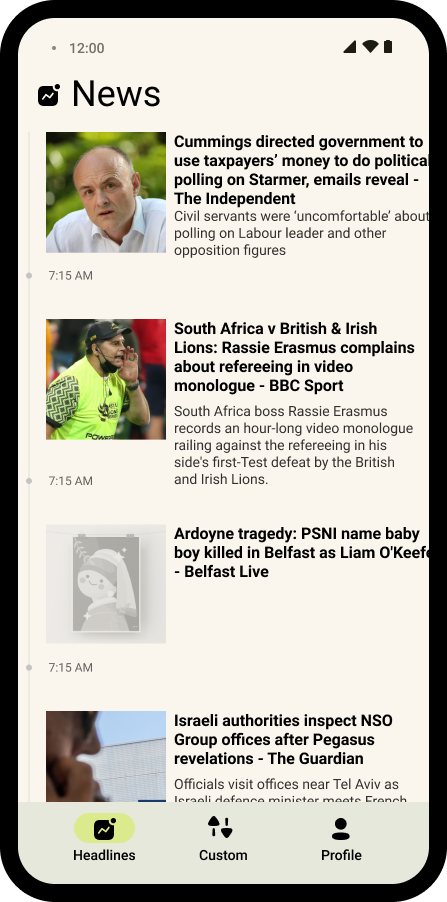
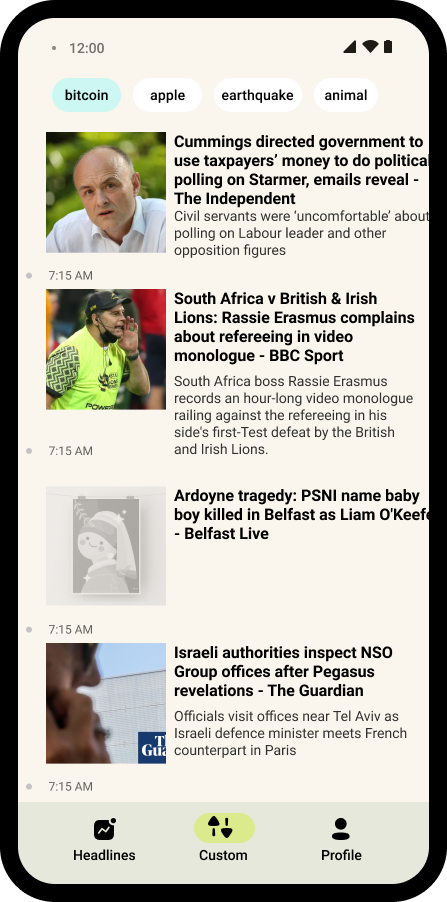
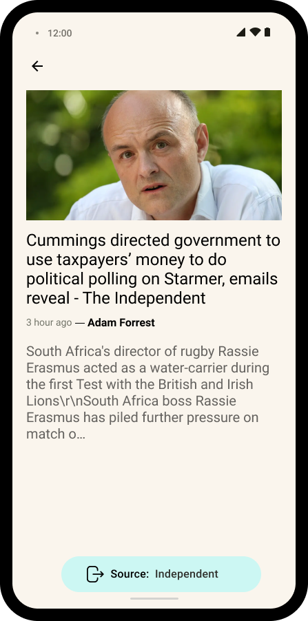
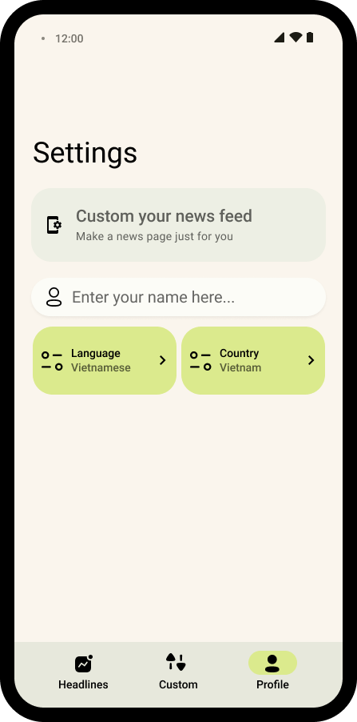
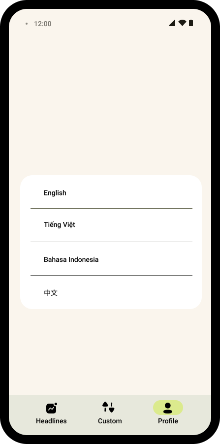

# NewsAPI Flutter App


[](https://codecov.io/gh/potato16/newsapi_flutter)


### Project features

- Structure: MVVM
- Navigation 2.0
- State management: Riverpod

### App features

- Top headlines page.
- Custom news page.
- Profile page: update user name, language, and country.

### How to run

Get NewsAPI api key from : [https://newsapi.org/](https://newsapi.org/)

- Command line:

```bash
flutter run --dart-define=APIKEY=Enter your api key here...
```

- VS Code:

```json
"configurations": [
        {
            "name": "Debug",
            "type": "dart",
            "request": "launch",
            "program": "lib/main.dart",
            "args": [
                "--dart-define=APIKEY=Enter you api here"
            ]
        }

    ]
```

### Design








Design inspirations: 

- [https://dribbble.com/shots/14700802-News-Section](https://dribbble.com/shots/14700802-News-Section)
- [https://dribbble.com/shots/10759980-Bastion-Articles-App](https://dribbble.com/shots/10759980-Bastion-Articles-App)
- [https://dribbble.com/shots/11707337-NY-Times-Article/attachments/3330893?mode=media](https://dribbble.com/shots/11707337-NY-Times-Article/attachments/3330893?mode=media)

Design resources: 

- [https://www.figma.com/community/file/976668012616887402](https://www.figma.com/community/file/976668012616887402)
- [https://www.figma.com/community/file/984211592210370699](https://www.figma.com/community/file/984211592210370699)

### Report
Test Coverage: [Codecov](https://app.codecov.io/gh/potato16/newsapi_flutter)
